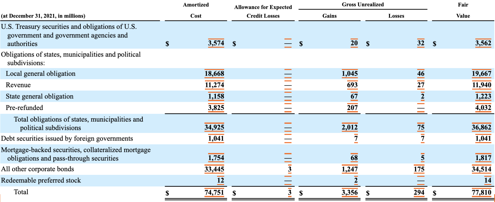
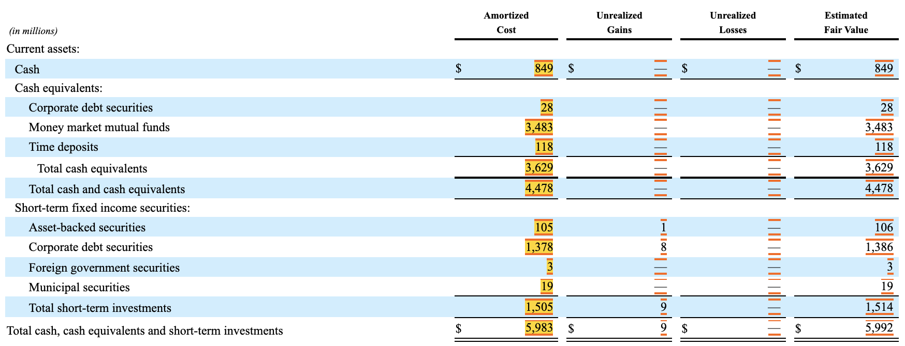
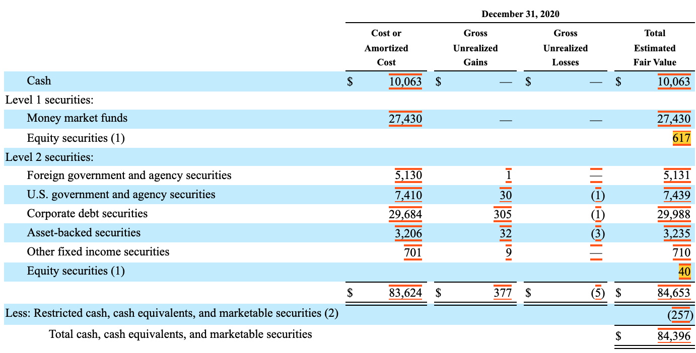
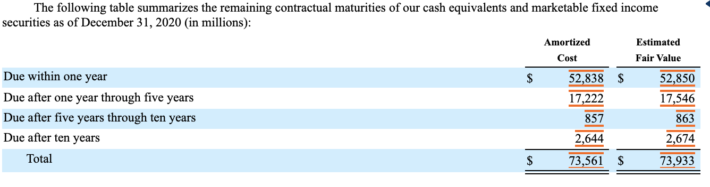
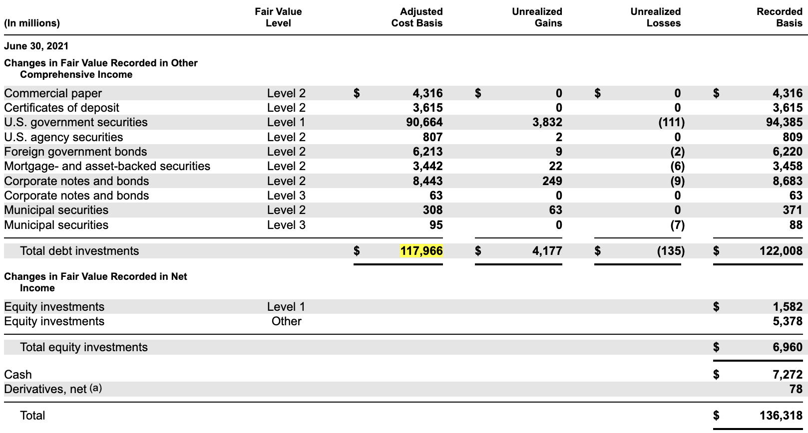
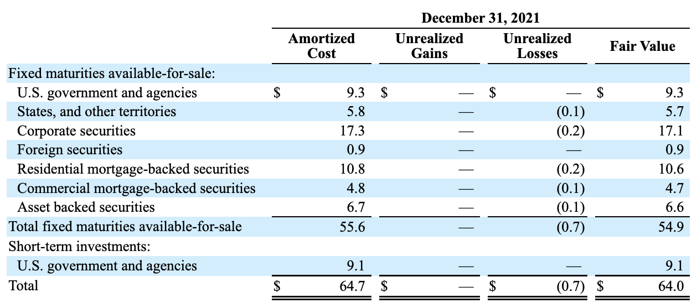

## XBRL US Center for Data Quality Committee Guidance
# Investment Guidance FAQ
Status: Public Exposure July 15 - August 31, 2022 - provide comment at https://xbrl.us/public-review  
Release date: TBD  
Effective date: TBD  

This guidance is intended to supplement the guidance provided by the FASB Implementation guide Financial Instruments—Debt Securities.

The guidance is based on the assumption that the values reported include accrued interest. If the filer makes the accounting policy election to exclude accrued interest, use the ‘excluding’ accrued interest elements (except for Q5).

This guidance only illustrates modeling for available-for-sale securities (not held-to-maturity securities). 

### Q1. In the case below where the breakdown of available securities has subtotals. What Axis should the company use to represent the subtotals of Amortized Cost?

In this case the values for the "Total obligations of states, municipalities and political subdivisions" should be tagged using the FinancialInstrumentAxis with a member to represent the subtotal. The member representing the subtotal should be nested with children of the members representing the financial instruments comprising that subtotal on the FinancialInstrumentAxis. This ensures that the values reported for the amortized cost will all use the axis FinancialInstrumentAxis and the concept AvailableForSaleDebtSecuritiesAmortizedCostBasis. Filers should not use the Investment Type Axis. The InvestmentTypeAxis is intended to be used when all investments are measured on the same basis such as for Investment Companies.  

### Q2. In the example below the company has reported cash as part of the investment schedule. Should the value of 849 be tagged with the **CashMember** on the FinancialInstrumentAxis or should it be tagged with the concept Cash?

The value of $849 for cash at amortized cost should be tagged with the element Cash for both values in the amortized cost column and the estimated fair value column. 

The values for Cash Equivalents should be tagged with the element  CashEquivalentsAtCarryingValue. The breakdown of the cash equivalent items should use the dimension CashAndCashEquivalentsAxis. The value of 4,478 should be tagged with the element CashAndCashEquivalentsAtCarryingValue and have no dimensions. A calculation should be included to add Cash and CashEquivalentsAtCarryingValue to CashAndCashEquivalentsAtCarryingVale.

Alternatively, the value of $849 for cash could be tagged with the element CashAndCashEquivalentsAtCarryingValue with CashMember on CashAndCashEquivalentsAxis. The value of 3,629 presenting the subtotal of Cash Equivalents could be tagged with the element CashAndCashEquivalentsAtCarryingValue with CashEquivalentsMember on CashAndCashEquivalentsAxis. The

CashEquivalentsMember representing the subtotal should be nested with children of the members representing the different cash equivalents comprising that subtotal on the CashAndCashEquivalentsAxis. The value of 4,478 should be tagged with the element CashAndCashEquivalentsAtCarryingValue and have no dimensions. The tagging is the same for both values in the amortized cost column and the estimated fair value column.

The approach used above is determined based on the captions used on the Statement of Financial Position. If Cash appears on the Statement of Financial Position then the Cash element should be used in the footnote.  If the element CashAndCashEquivalentsAtCarryingValue is used on the Statement of Financial Position then the second approach should be used. 

The values for the unrealized gains and losses do not need to be tagged, if the values for the amortized costs and fair value are the same.

The values under the heading of "Total short-term investments" should be reported using the element  AvailableForSaleSecuritiesDebtSecuritiesCurrent[^1] for the fair value amounts and DebtSecuritiesAvailableForSaleAmortizedCostCurrent for the amortized amount with no dimensions.

These values are disaggregated using the FinancialInstrumentAxis. The value of 5,992 in the estimated fair value column should be reported with the element CashCashEquivalentsAndShortTermInvestments. For the amortized cost value of $5,983 an extension element has to be used. The extension element CashAndCashEquivalentsAtCarryingValueAndAvailableForSaleDebtSecuritiesAmortizedCostBasisCurrent should be used to report this value.

### Q3. In the following disclosure the company has included the estimated value of equity securities in the table. What element should the values for Equity Securities be tagged with? 

The fair values of equity securities should be tagged with EquitySecuritiesFvNi and the Fair Value by Hierarchy axis. 

### Q4. In the example above what should the value of 83,624 be tagged with?  

This should use the extension element CashAndCashEquivalentsAtCarryingValueAndAvailableForSaleDebtSecuritiesAmortizedCostBasis.

### Q5. The disclosure below relates to the disclosure in question 3 (excluding Cash and equity securities). What element should the values of 73,561 and 73,933 be tagged with?

The 73,561 should be tagged with AvailableForSaleDebtSecuritiesAmortizedCostBasis and the value of 73,933 should be tagged with AvailableForSaleSecuritiesDebtSecurities. 

If securities without a single maturity date are presented, then the elements, AvailableForSaleSecuritiesDebtMaturitiesSingleMaturityDateAmortizedCostBasis and AvailableForSaleSecuritiesDebtMaturitiesWithoutSingleMaturityDateFairValue would be used. 

There are no ‘excluding’ accrued interest maturity elements for available-for-sale securities, as that is not a required disclosure for the maturity groupings for AFS Debt Securities Amortized Cost and Fair Value disclosures. Therefore, in the table above, filers should use the maturity elements under Debt Securities, Available-for-Sale, Fair Value, Fiscal Year Maturity [Abstract] or Debt Securities, Available-for-Sale, Maturity, Allocated and Single Maturity Date, Rolling Maturity, Fair Value [Abstract]. However, the total values should still be reported with the specific including or excluding accrued interest element. 

### Q6. The amortized cost column has the same value for Amortized Cost before and after credit losses (i.e., the allowance for credit losses is zero). What element should be used to tag the amortized value. Should it be AvailableForSaleDebtSecuritiesAmortizedCostBasis or DebtSecuritiesAvailableForSaleAmortizedCostAfterAllowanceForCreditLoss?

If not otherwise stated use the element AvailableForSaleDebtSecuritiesAmortizedCostBasis. If both values are the same and are both reported then both elements should be used. A data user should assume that if the element DebtSecuritiesAvailableForSaleAmortizedCostAfterAllowanceForCreditLoss is not reported, then it has the same value as AvailableForSaleDebtSecuritiesAmortizedCostBasis. 

### Q7. In the following disclosure should the value of 117,966 be tagged with the DebtSecuritiesMember on the financial Instruments axis?

The value of 117,966 should be reported with no dimensions using the element AvailableForSaleDebtSecuritiesAmortizedCostBasis. All values on the line labeled Total debt investments should have no dimensions.

The value of 7,272 on the cash row in the figure above should be tagged using the element Cash, see Question 2.

### Q8. What elements are used when the schedule is split between the current and non current portions shown in the example below.  

In this case the values excluding short term investments use the element DebtSecuritiesAvailableForSaleAmortizedCostNoncurrent. The value of short term investments should use the element DebtSecuritiesAvailableForSaleAmortizedCostCurrent with the FinancialInstrumentAxis.  Create custom extensions for the gains and losses as current and noncurrent. The following extension elements should be used:
  

Noncurrent Gains:  
 -  AvailableForSaleDebtSecuritiesAccumulatedGrossUnrealizedGainBeforeTaxNoncurrent  

Noncurrent Losses:  
 -  AvailableForSaleDebtSecuritiesAccumulatedGrossUnrealizedLossBeforeTaxNoncurrent 

Current Gains:  
 -  AvailableForSaleDebtSecuritiesAccumulatedGrossUnrealizedLossBeforeTaxCurrent 

Current Losses  
 -  AvailableForSaleDebtSecuritiesAccumulatedGrossUnrealizedLossBeforeTaxCurrent

[^1]:
     This should be consistent with the element used on the Statement of Financial Position if disclosed separately.