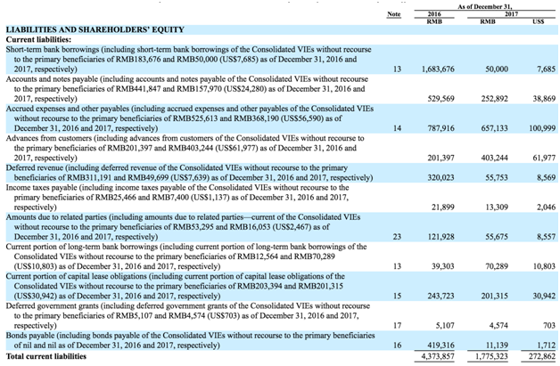
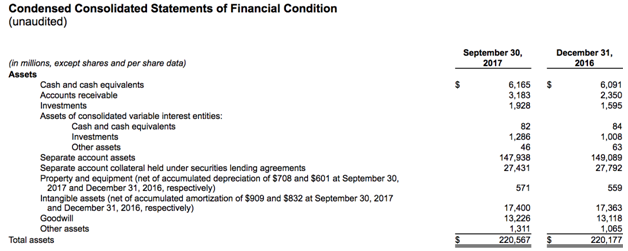
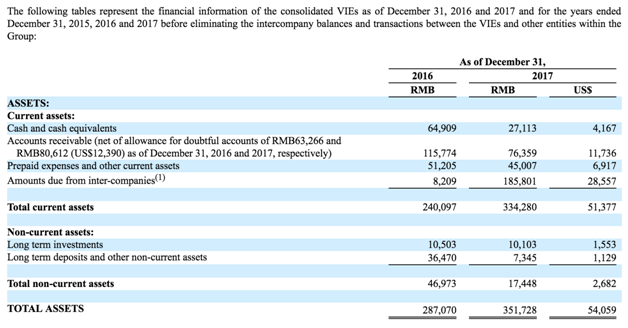

## XBRL US Center for Data Quality Committee Guidance
# Variable Interest Entities
### Draft for Committee approval to expose for public review and comment - March 3, 2020

## Consolidated Entities

When the details of variable interest entities are reported in the face financial statements they can either be broken down by line item or as a parenthetical disclosure.  In either case the amounts applicable to the variable interest entities in aggregate should use the _ConsolidatedEntitiesAxis_

and the member _VariableInterestEntityPrimaryBeneficiaryMember_. 

DQC Rule 83 identifies those cases where the filer has used _VariableInterestEntitiesByClassificationOfEntityAxis_ with either of  the following members on the face financial statements:

*   _VariableInterestEntityPrimaryBeneficiaryAggregatedDisclosureMember_
*   _VariableInterestEntityPrimaryBeneficiaryMember_

and recommends replacement of the axis with the_ ConsolidatedEntitiesAxis_

In the example below the company reports the portion of account balances applicable to the variable interest entity as a parenthetical disclosure for each period of the disclosure.

 
The parenthetical amounts are applicable to the variable interest entity included in the balance sheet line items.  As such these disclosures are tagged using the balance sheet items used in the balance sheet and should use the _ConsolidatedEntitiesAxis_ and the member _VariableInterestEntityPrimaryBeneficiaryMember_[[1]](#ftn1).  This member is used because the Primary Beneficiary member represents the value consolidated by the company. 

Alternatively the company below has separately  reported cash, Investments and other assets specifically for the variable interest entity in the balance sheet with values of 82 and 1,286 and 46 in the column for the year 2017.  To ensure tagging consistency with the above example this amount should be tagged with the appropriate balance sheet line item and the ConsolidatedEntitiesAxis and the member _VariableInterestEntityPrimaryBeneficiaryMember_.  The value for $6,165 for cash and cash equivalents on row 1  cannot be tagged with the default value as it excludes the holdings of the variable interest entities.

For values which exclude the amount attributable to the VIE (for example 6,165) the filer should use the member  _ConsolidatedEntityExcludingVariableInterestEntitiesVIEMember on the ConsolidatedEntitiesAxis_ with the associated balance sheet line item.

When a company reports the total values for a group of variable interest entities prior to consolidation, the _ConsolidatedEntitiesAxis_ should be reported with the member _VariableInterestEntityPrimaryBeneficiaryMember_ and the _ConsolidationItemsAxis_ with the member <em>ReportableLegalEntitiesMember</em>.

See example below:

All of the values in the table above will be tagged with the members _VariableInterestEntityPrimaryBeneficiaryMember_ and _ReportableLegalEntitiesMember._

US GAAP taxonomies up to 2019 included in the VIE section of the taxonomy a balance sheet location axis to facilitate reporting the balances on the balance sheet of the portion applicable to the VIE.  This was originally designed to allow the use of the Consolidated VIE line items in conjunction with the _BalanceSheetLocationAxis_. This approach however is inconsistent with the introduction of the consolidation axis in the US GAAP taxonomy.  The recommended approach is to discontinue use of the _BalanceSheetLocationAxis_  and instead use the balance sheet line items with the _ConsolidatedEntitiesAxis_ and _VariableInterestEntityPrimaryBeneficiaryMember_  as discussed above. Filers should not use the following elements for VIE reporting in their filings[[2]](#ftn2):

1. VariableInterestEntityConsolidatedAssetsCurrent
2. VariableInterestEntityConsolidatedAssetsNoncurrent
3. VariableInterestEntityConsolidatedCarryingAmountAssets
4. VariableInterestEntityConsolidatedLiabilitiesCurrent
5. VariableInterestEntityConsolidatedLiabilitiesNoncurrent
6. VariableInterestEntityConsolidatedCarryingAmountLiabilities
7. VariableInterestEntityConsolidatedCarryingAmountAssetsAndLiabilitiesNet

All of these line items should be expressed using the balance sheet elements (Listed Below) and the _ConsolidatedEntitiesAxis_ with the VIE member  _VariableInterestEntityPrimaryBeneficiaryMember_

1. AssetsCurrent
2. AssetsNoncurrent
3. Assets
4. LiabilitiesCurrent
5. LiabilitiesNoncurrent
6. Liabilities

DQC Rule 82 identifies cases where the incorrect line item elements are used and suggests replacement with the appropriate balance sheet elements.

<!-- Footnotes themselves at the bottom. -->
## Notes

<a name="ftn1">[1]</a>:
     Filers should not use the member VariableInterestEntityPrimaryBeneficiaryAggregatedDisclosureMember to report the total of consolidated VIE’s.  This member is deprecated in the 2020 taxonomy.

<a name="ftn2">[2]</a>:
     These elements have been deprecated in the 2020 taxonomy.